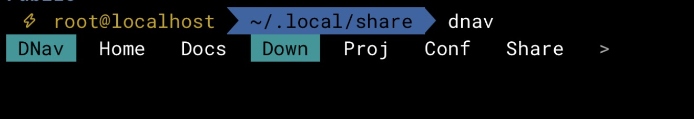
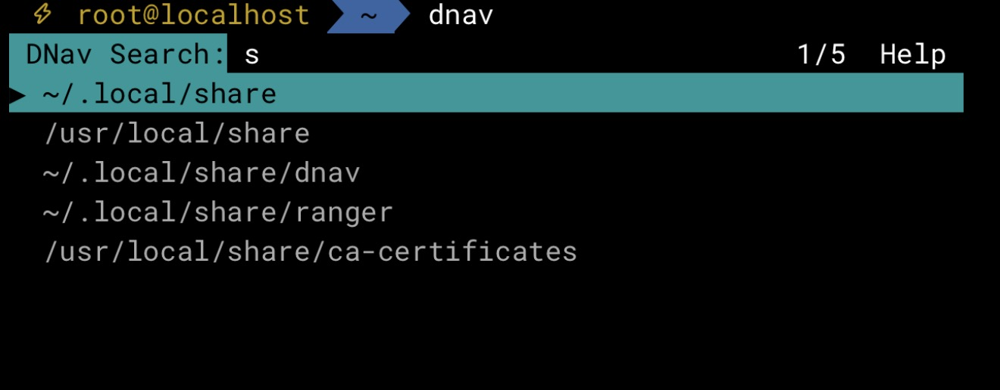
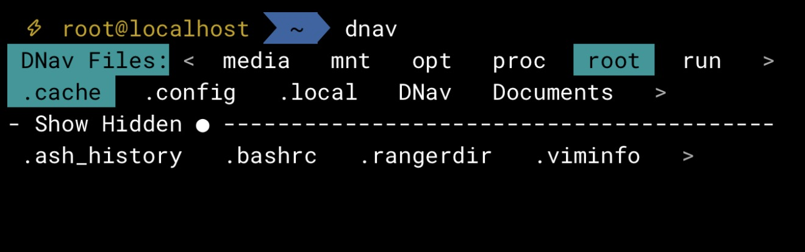

# DNav

A zsh navigation helper: folder bar, file explorer, fuzzy search, and shell jump aliases (`dhome`, `dproj`, …).

Note: I made this for myself, I used AI heavily since it’s a personal project and I cared about rapid dev more than code quality. 

If you hate AI, cool, don’t use it.

If you like the concept and would use it except that AI was used in making it then cool, feel free to rewrite it. 

It was made for my own use, I just made it public in case someone else found it useful.

The primary module dnav gives the ability to jump to favorited spots with a minimal GUI.


An optional secondary module dsearch gives the ability to search for and jump to locations.


The optional module dfile adds a minimal file explorer that lets you jump to locations and into editing if you have one configured for your system.


## Install

```bash
git clone https://github.com/Ebsolas/DNav.git
cd DNav
./install.sh
exec zsh          # reload shell
```

The installer will:

1. Copy scripts from `zsh/` to `~/.local/share/dnav/` (or `$XDG_DATA_HOME/dnav`)
2. Seed config under `~/.config/dnav/` (without overwriting existing files)
3. Add a source hook to `~/.zshrc` (does **not** auto-run the TUI)

### Options

```text
./install.sh                 # default install
./install.sh --update        # refresh scripts + merge new config keys (keeps values)
./install.sh --prefix DIR    # install scripts elsewhere
./install.sh --config DIR    # alternate config directory
./install.sh --no-rc         # skip .zshrc edit
./install.sh --force-config  # overwrite config/folders/jumps with defaults
./install.sh --uninstall     # remove scripts + rc hook (keeps config)
```

### Update an existing install

From a new shell, either:

```bash
dnav --update                    # copies repo → ~/.local/share/dnav and reloads
```

or from the clone:

```bash
cd /path/to/DNav
git pull                         # if you use git
./install.sh --update
exec zsh
```

`dnav --update` / `./install.sh --update` overwrite scripts and add any new keys to `~/.config/dnav/config`. Existing values, comments, folders, and jumps are left as they are.

If the repo is not next to the install, point at it:

```bash
DNAV_UPDATE_FROM=~/src/DNav dnav --update
```

### Manual install

```zsh
mkdir -p ~/.local/share/dnav ~/.config/dnav
cp zsh/dnav zsh/dfile zsh/djump zsh/dsearch zsh/jumps ~/.local/share/dnav/
# then in ~/.zshrc:
source ~/.local/share/dnav/dnav
```

## Usage

| Command | What it does |
|---------|----------------|
| `dnav` | Open the navigation TUI |
| `dhelp` | List jump aliases (same as `djump -l`) |
| `dnav --help` | Shell commands |
| `dconfig` / `dconfig -r` | Show/reload config |
| `dconfig -e` | Edit config files in `$EDITOR` |
| `dnav --update` | Refresh scripts + merge new config keys |
| `djump -l` | List jump aliases |
| `dhome`, `dproj`, … | Jump without opening the TUI |
| `djump add LABEL [PATH]` | Add a jump (default path: `$PWD`) |
| `djump edit LABEL [PATH]` | Update a jump path |
| `djump remove LABEL` | Remove a jump + `dLABEL` command |
| `djump --check` | Report shadowed or stolen `dKEY` names |

### In the TUI

- **←/→** or **h/l** — move on the bar  
- **Enter** — open folder / About  
- **/** or **s** — fuzzy search  
- **f** — file explorer  
- **About** chip — Help + Settings (Tab to switch; edit config in place)

## Config

```text
~/.config/dnav/config     # colors, brand, ls_after, show_hidden, …
~/.config/dnav/folders    # main bar labels + paths
~/.config/dnav/jumps      # dKEY aliases (home → dhome)
```

`dnav f [PATH]` opens the file explorer (invalid PATH lands on the nearest existing folder). `dnav s [QUERY]` opens search.

After editing: `dconfig -r` (or About → Settings).

`ls_after = 1` in `config` runs `ls -a` after a successful jump/select.

Search indexes `$HOME` unless you set `search_roots` (or `DNAV_SEARCH_ROOTS`) to a space-separated list. First-run `folders` / `jumps` are generic (`Home` `Docs` `Down` `Config`); existing user files are never overwritten.

## Requirements

- **zsh** (primary), **bash 4+**, or **PowerShell 5.1+ / pwsh 7+**
- A terminal that supports common ANSI escapes

### PowerShell (cross-platform)

```powershell
# Linux: symlink or copy powershell/ → ~/.local/share/dnav-ps
# Windows: drop into Documents\PowerShell\dnav\
. "$HOME/.local/share/dnav-ps/dnav.ps1"   # or Windows path above
dnav
```

See [powershell/README.md](powershell/README.md).

## Tests

```bash
./tests/run.sh              # bash + zsh (default)
./tests/run.sh --zsh        # zsh only
./tests/run.sh --powershell # PowerShell (needs pwsh)
./tests/run.sh --all        # all three suites
```

See [tests/README.md](tests/README.md).
